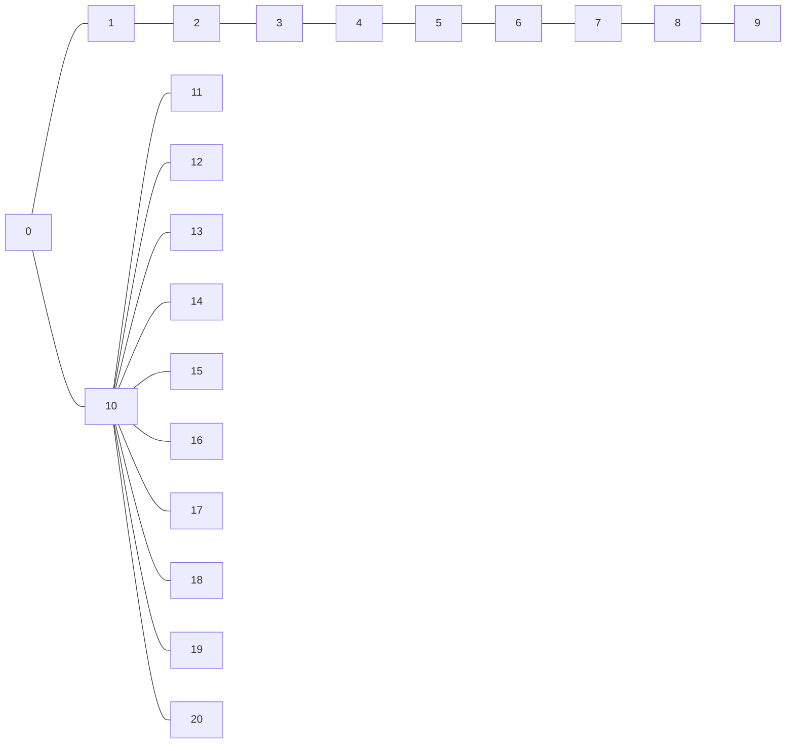
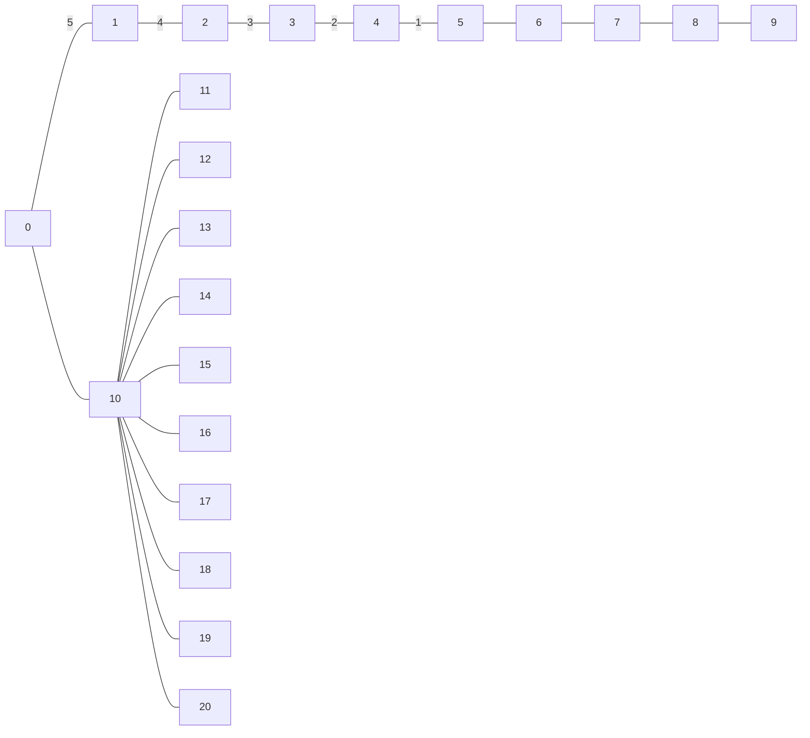

# Graph parser

The provided graph parser is written in `rust` and by running `cargo run -- --help` you get all options. It is mainly for parsing graphs to `lp` or `ilp` format.

Next you run `gurobi_cl ResultFile="graph.sol" graph.lp` to solve the linear program.

## Given instance is a graph



In text for parser it is.

```txt
s=0
k=6
[0;1][1;2][2;3][3;4][4;5][5;6][6;7][7;8][8;9] # The path.
[0;10][10;11][10;12][10;13][10;14][10;15][10;16][10;17][10;18][10;19][10;20]
```

### Optimal value

Optimal value of the flow is following.


